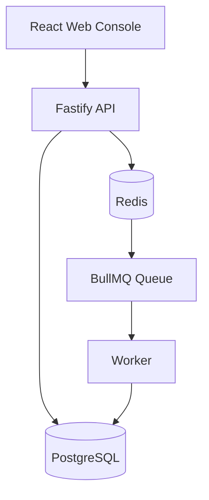
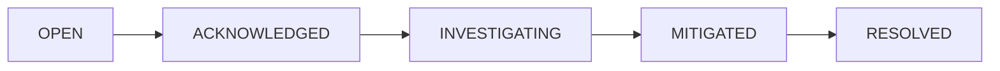
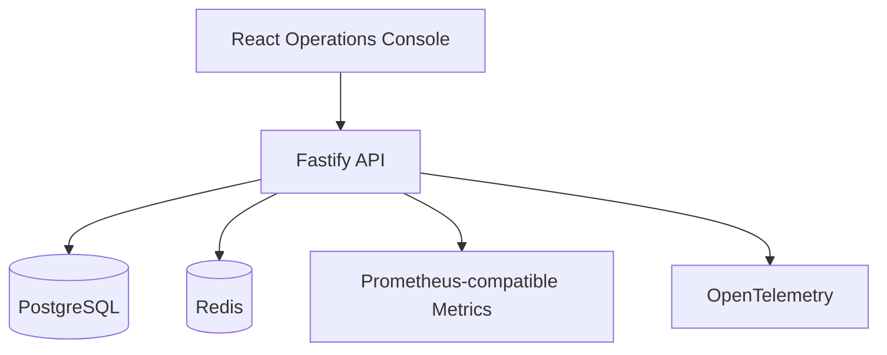
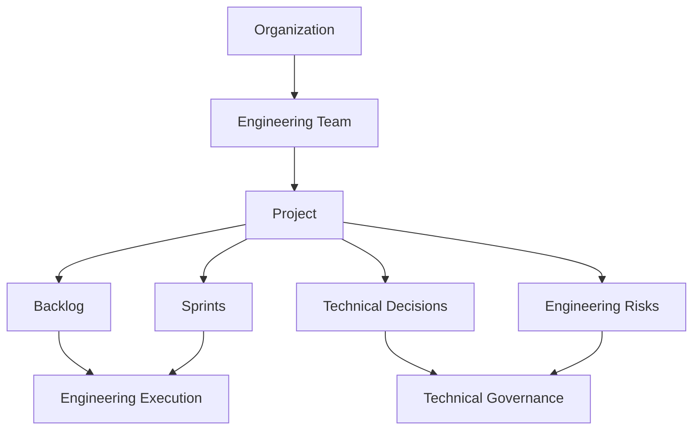
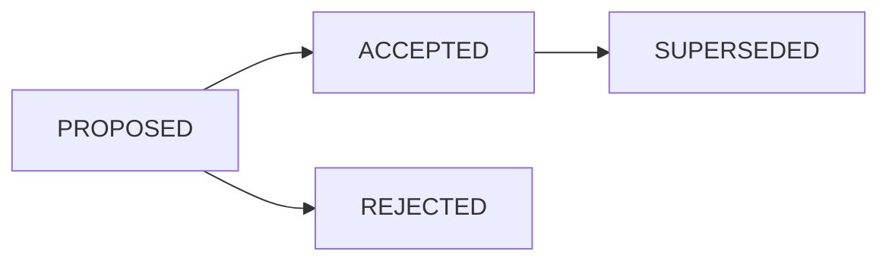

# Hi, I'm Matheus Moraes 👋

### Software Engineering | Automation & AI | Architecture | Technical Leadership

Software developer focused on **back-end engineering, business systems, process automation, AI-assisted solutions, reliability, and digital products**.

I enjoy understanding real operational problems, translating them into technical solutions, and taking projects from **requirements and architecture to implementation, testing, deployment, runtime validation, and continuous improvement**.

My background combines software development, automation, infrastructure, UX/UI, production support, and collaboration with technical and non-technical teams.

<p align="left">
  <a href="https://www.linkedin.com/in/moraies/">
    
  </a>
  <a href="https://madebytheux.com">
    
  </a>
  <a href="mailto:moraeesdeveloper@gmail.com">
    
  </a>
</p>

---

# About Me

- 🎓 Graduate in **Systems Analysis and Development**
- 💻 Working with **software development, automation, systems, and digital products**
- 🏗️ Building projects focused on real software engineering problems
- ⚙️ Interested in **back-end systems, architecture, automation, reliability, and AI**
- 🤝 Experience collaborating with technical, operational, business, and design teams
- 🧠 Deepening my knowledge in **Software Architecture, Observability, Security, AI, and Technical Leadership**
- 📍 Rio de Janeiro, Brazil

---

# Tech Stack

## Languages & Front-end

<p align="left">
  
</p>

## Data & Persistence

<p align="left">
  
</p>

## Infrastructure & Tools

<p align="left">
  
</p>

## Back-end & Engineering

<p align="left">
  
  
  
  
  
  
  
</p>

### Architecture & Engineering Practices

`Modular Monolith`
`Multi-tenancy`
`REST APIs`
`RBAC`
`JWT`
`Refresh Token Rotation`
`Workflow Engines`
`Async Processing`
`Queues`
`Observability`
`Structured Logging`
`Metrics`
`Tracing`
`Docker`
`CI/CD`
`Automated Testing`
`ADRs`
`OWASP Fundamentals`

---

# What I Work With

### Software Engineering

I build and maintain applications, APIs, internal systems, dashboards, and digital products with focus on **maintainability, reliability, security, and business value**.

### Automation & AI

I develop solutions focused on reducing manual work, connecting systems, orchestrating workflows, and applying AI to practical business problems.

### Architecture & Reliability

I am deepening my work around architecture decisions, observability, incident management, security, testing, operational reliability, and system design.

### Technical Leadership

My professional direction combines hands-on engineering with:

- Technical decision-making
- Requirements analysis
- Backlog prioritization
- Architecture discussions
- Risk analysis
- Knowledge sharing
- Stakeholder communication
- Supporting less experienced professionals
- Continuous improvement
- Product and Engineering alignment

---

# Featured Engineering Projects

These projects explore **different areas of software engineering** instead of repeating the same application pattern.

| Project | Main Engineering Focus |
| --- | --- |
| **FlowPilot AI** | Automation, asynchronous processing & AI |
| **OpsBoard** | Reliability, incidents & observability |
| **TeamForge** | Technical leadership, architecture & engineering execution |

---

# 01 — FlowPilot AI

## Workflow Automation & AI Platform

<p align="left">
  
  
  
  
  
  
  
  
</p>

A multi-tenant workflow automation platform designed to automate business processes through **workflow orchestration, asynchronous execution, conditional logic, integrations, tasks, and AI-based classification**.

FlowPilot started as a back-end engineering project and evolved into a complete demonstrable product with an operational web console.

### Product Capabilities

- Workflow creation and management
- Conditional execution
- AI-based classification
- Asynchronous job processing
- Task creation and management
- Execution history
- Audit logs
- Multi-tenant isolation
- Role-based access control
- System health monitoring
- Operational dashboard

### Architecture



### Engineering Highlights

- Modular monolith architecture
- Organization-level tenant isolation
- API and worker separation
- Redis + BullMQ asynchronous processing
- Workflow execution engine
- Conditional branching
- Idempotent execution
- Workflow version snapshots
- JWT authentication
- Refresh token rotation
- RBAC
- HTTP integrations
- SSRF protection
- AI provider abstraction
- Structured logging
- Request correlation
- Metrics
- Health & readiness endpoints
- OpenTelemetry foundation
- Automated testing
- GitHub Actions CI
- Architecture Decision Records

### Engineering Lesson

During complete Docker runtime validation, the API and worker initially failed because the production logging configuration attempted to load `pino-pretty`, which existed only as a development dependency.

The runtime configuration was corrected so:

- development uses human-readable logs;
- production uses structured JSON logs.

A regression test was also added.

> **A successful build and passing tests do not replace real runtime validation.**

### Repository

[github.com/iMoraies/flowpilot-ai](https://github.com/iMoraies/flowpilot-ai)

---

# 02 — OpsBoard

## Incident Management & Reliability Platform

<p align="left">
  
  
  
  
  
  
  
</p>

OpsBoard is a platform focused on **incident management, service health, availability, MTTR, postmortems, auditability, and operational reliability**.

The project explores how engineering teams can respond to failures, understand service health, document operational incidents, and measure reliability.

### Product Capabilities

- Service catalog
- Service health tracking
- Incident creation
- Severity management
- Incident lifecycle
- Incident timeline
- Notes and mitigation events
- Incident resolution
- Postmortems
- Availability tracking
- MTTR calculation
- Audit logs
- Multi-tenant isolation
- RBAC
- Operational dashboard

### Incident Lifecycle



### Architecture



### Engineering Highlights

- Modular monolith architecture
- Incident state machine
- Multi-tenant isolation
- Availability calculation
- MTTR calculation
- Service health rules
- JWT authentication
- Refresh token rotation
- RBAC
- Audit trail
- Structured logging
- Prometheus-compatible metrics
- OpenTelemetry foundation
- Health & readiness checks
- Dockerized runtime
- Automated testing
- GitHub Actions CI
- Architecture Decision Records

### Architecture Decision

BullMQ was evaluated for asynchronous metrics recalculation but was intentionally **not added**.

The current workload can be handled synchronously without introducing queue infrastructure unnecessarily.

This decision represents a trade-off between:

**simplicity ↔ operational complexity ↔ future scalability**

The architecture can evolve if the workload later justifies asynchronous processing.

### Repository

[github.com/iMoraies/opsboard](https://github.com/iMoraies/opsboard)

---

# 03 — TeamForge

## Engineering Leadership & Technical Execution Platform

<p align="left">
  
  
  
  
  
  
  
</p>

TeamForge is a platform designed around **technical leadership, engineering execution, prioritization, architecture decisions, technical risks, and Product/Engineering alignment**.

Instead of being another generic task manager, TeamForge explores the information a technical leader needs to understand:

- what the team is building;
- what is blocked;
- which technical decisions are pending;
- what risks are threatening delivery;
- how priorities are changing;
- what technical debt exists;
- who is responsible for each area.

### Product Capabilities

- Team management
- Project management
- Backlog
- Sprint lifecycle
- Business value
- Technical complexity
- Prioritization
- Blocked item management
- Technical debt tracking
- Architecture decisions
- ADR-style records
- Decision approval
- Decision supersession
- Risk management
- Risk scoring
- Mitigation plans
- Comments
- Audit trail
- RBAC
- Multi-tenancy
- Engineering dashboard

### Engineering Execution Model



### Decision Lifecycle



### Risk Model

Risk scoring uses a simple model based on:

**Probability × Impact**

The goal is not to create an absolute prediction, but to provide a consistent tool for comparing technical and delivery risks.

Examples of risk categories:

`Technical`
`Delivery`
`Security`
`Dependency`
`People`
`Product`

### Engineering Highlights

- Modular monolith architecture
- Multi-tenant isolation
- ADMIN / TECH_LEAD / DEVELOPER / PRODUCT RBAC
- Project health model
- Backlog lifecycle
- Sprint lifecycle
- Technical decision state machine
- Decision supersession
- Architecture Decision Records
- Risk scoring
- Risk mitigation
- Audit logging
- Comments
- JWT authentication
- Refresh token rotation
- Structured logging
- Health & readiness endpoints
- Metrics
- Docker
- Automated tests
- GitHub Actions CI
- Technical documentation

### Architecture Decision

Redis was evaluated but intentionally **not introduced**.

There was no strong caching or asynchronous processing requirement that justified the additional infrastructure.

This decision keeps the architecture simpler while preserving the possibility of introducing Redis later when supported by measurable requirements.

> **Technology should solve a problem, not exist only to increase the size of the stack.**

### Repository

[github.com/iMoraies/teamforge](https://github.com/iMoraies/teamforge)

---

# The Engineering Journey Behind These Projects

The three projects were intentionally designed to explore different engineering challenges.

```text
FlowPilot AI
     │
     ├── Automation
     ├── Workflows
     ├── Queues
     ├── AI
     └── Async Processing

OpsBoard
     │
     ├── Reliability
     ├── Incidents
     ├── Availability
     ├── MTTR
     └── Observability

TeamForge
     │
     ├── Technical Leadership
     ├── Backlog & Sprints
     ├── Architecture Decisions
     ├── Risk Management
     └── Engineering Execution
```

Together, they allow me to practice not only **how to write code**, but also how to think about:

- architecture;
- failure;
- operations;
- security;
- technical trade-offs;
- maintainability;
- team execution;
- business context;
- technical leadership.

---

# Engineering Principles

### Build for the current problem

Avoid unnecessary complexity and introduce infrastructure only when there is a clear reason.

### Validate at runtime

Passing tests and builds are important, but the actual application must also run correctly in a realistic environment.

### Document decisions

Architecture Decision Records help preserve context, alternatives, consequences, and trade-offs.

### Security belongs in the architecture

Authentication, authorization, tenant isolation, input validation, secrets, and logging need to be considered from the beginning.

### Observability is part of the product

Logs, health checks, metrics, request correlation, and tracing foundations help make systems understandable when something goes wrong.

### Architecture is about trade-offs

There is rarely one perfect technology or architecture. The important part is understanding the context and being able to explain why a decision was made.

---

# Current Engineering Focus

I'm currently deepening my knowledge and practice in:

- Software Architecture
- Back-end Architecture
- System Design
- Node.js & TypeScript
- Automated Testing
- CI/CD
- Observability
- Reliability Engineering
- Incident Management
- Application Security
- OWASP
- AI Agents
- AI-powered Automation
- Event-driven Architecture
- Cloud Architecture
- Technical Leadership
- Engineering Communication

My goal is to evolve toward roles where I can combine:

> **hands-on software engineering + architecture + automation + AI + reliability + business understanding + technical leadership**

---

# Connect With Me

<p align="left">

<a href="https://www.linkedin.com/in/moraies/">
  
</a>

<a href="https://github.com/iMoraies">
  
</a>

<a href="https://madebytheux.com">
  
</a>

<a href="mailto:moraeesdeveloper@gmail.com">
  
</a>

</p>

---

<p align="center">
  <b>Software Engineering • Architecture • Automation • Reliability • AI • Technical Leadership</b>
</p>
